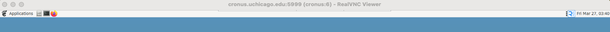
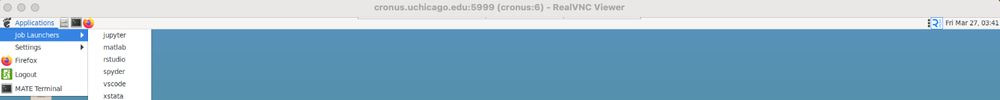
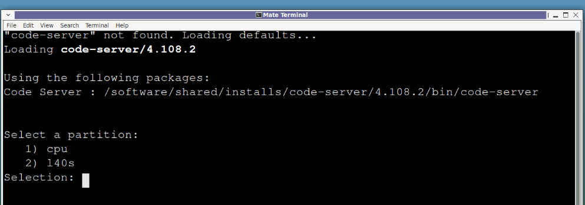
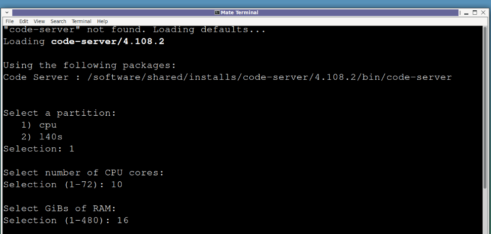
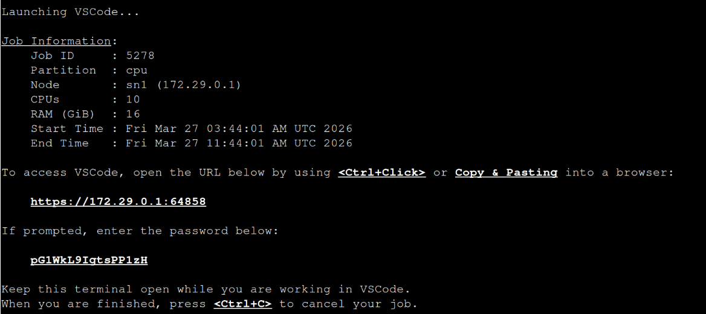
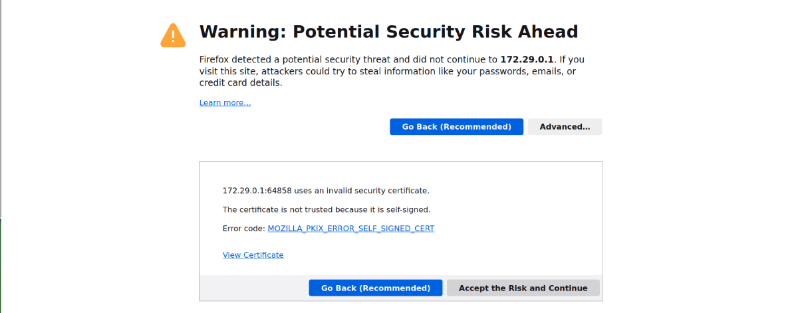

# VSCode via VNC Viewer

This guide walks you through launching a VS Code session on the SSCS cluster using a VNC connection.

## Prerequisites

**VNC Viewer installed and connected to the cluster login node**. 

If you have not yet set up VNC Viewer or connected to the login node, refer to the [VNC Viewer Setup Guide](./../../getting-started/accessing-the-cluster/#graphical-access-realvnc) before proceeding.

## Steps

### Step 1: Connect to the Cluster via VNC

Connect to CVPN (if off-campus) and open your VNC Viewer session to the cluster login node. Refer to the [Accessing the Cluster](./../../getting-started/accessing-the-cluster/) and [VNC Viewer Setup](./../../getting-started/accessing-the-cluster/#graphical-access-realvnc) guides for detailed instructions.

### Step 2: Launch VS Code from the Applications Menu

Once connected via VNC, click on **Applications** in the top-left menu bar.
Navigate to **Job Launchers** and select **vscode** from the list.

### Step 3: Select a Partition and Allocate Resources

A **MATE Terminal** window will open and load the `code-server` module automatically.
You will be prompted to configure your job resources:

1. **Select a partition** — choose between `cpu` or `l40s` (GPU)

    !!! note "GPU Node Access"
        GPU nodes are allocated based on research use case. If your workflow requires GPU resources, contact the Cluster Support team at [ssc-server-support@lists.uchicago.edu](mailto:ssc-server-support@lists.uchicago.edu) before submitting jobs to a GPU partition. The team will review your use case and configure the appropriate QoS options for your account.

    

2. **Select number of CPU cores and GiBs of RAM**

    

### Step 4: Launch and Access VS Code

Once resources are allocated, the terminal will display your **Job Information** 
along with a URL and a password to access VS Code.

To access VS Code:

1. **Ctrl+Click** the URL displayed in the terminal, or copy and paste it into 
the Firefox browser inside your VNC session.
2. If prompted with a **security warning** about a self-signed certificate, click 
**Advanced** and then **Accept the Risk and Continue**.

    

3. Enter the **password** displayed in the terminal when prompted.

    

4. If asked whether to trust the authors of files in the folder, click 
**Yes, I trust the authors**.

    

### Step 5: Keep the Terminal Open

Keep the MATE Terminal window open for the duration of your VS Code session. Closing it or pressing **Ctrl+C** will terminate your job and end your session.

## Ending Your Session

When you are done working, return to the MATE Terminal and press **Ctrl+C** to 
cancel your job and release the allocated resources.