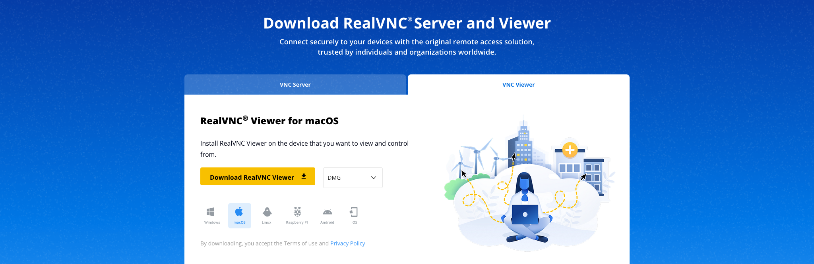
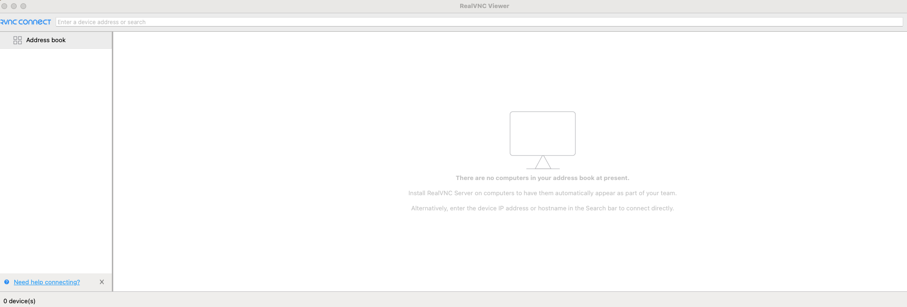
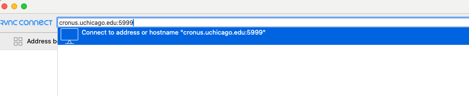
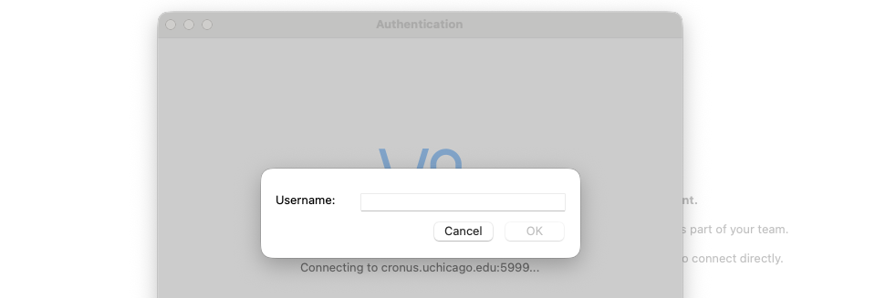
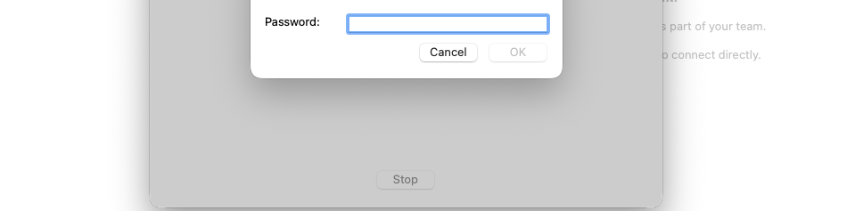

# Accessing Cluster

## Secure Shell Connect

After connecting the VPN<sup><b>#</b></sup>, SSH into the login node using a terminal on your personal device (Mac, Windows, Linux, etc.):

The examples below cover all available login nodes. Select the tab for your assigned cluster:

=== "Cronus" 

    ```bash linenums="1"
    ssh username@cronus.uchicago.edu
    ```

=== "Acropolis"

    ```bash linenums="1"
    ssh username@sscs-acropolis2.ssd.uchicago.edu
    ```

=== "Athens"

    ```bash linenums="1"
    ssh username@sscs-athens2.ssd.uchicago.edu
    ```

The `username` field is your CNET ID only, not your full email address.

!!! warning
    Login nodes are shared interactive systems built for file transfer, file editing and testing. **_Do not run heavy computations here_.**

!!! note "<sup><b>#</b></sup> Network Access"

    **On-campus users can connect to the cluster directly without VPN**. If you are off-campus, connect to the [UChicago CVPN](./connect-to-vpn.md) before attempting to access the cluster.

## SSH Tools

- **macOS/Linux:** Terminal (built-in SSH)
- **Windows:** Command prompt, PuTTY, PowerShell, WSL, MobaXterm

!!! tip
    Outbound SSH from the cluster is not available. Use local clients to pull data to your desktop if needed.


## Graphical Access (RealVNC)

If you require a graphical desktop environment, you may connect to the login node using **VNC Viewer**.

After connecting to the cVPN:

1. Download and install **VNC Viewer** from the [RealVNC website](https://www.realvnc.com/en/connect/download/viewer/){:target="_blank"}.

    

2. Open **VNC Viewer**.

    

3. In the **RealVNC Connect** address bar, enter the login node hostname or IP address followed by the VNC port (`5999`).

    > **Example for Cronus:**
    
    > `cronus.uchicago.edu:5999`

    

4. Press **Enter**.

5. When prompted, log in using your **CNET ID username** (not your full email address) and password.

    

    

    !!! Info
        Once your login is approved via Duo, you may be returned to the credentials prompt. If so, click **OK** again to complete the login and proceed to the VNC session.

6. Accept any security or certificate prompt if displayed.

    

---

## Two-Factor Authentication

The cluster requires Two-Factor Authentication (2FA) via Duo for all user accounts. Ensure Duo is set up on your device prior to accessing the cluster.

!!!info "Two-Factor Authentication"
    
    To set up Two-Factor Authentication (Duo) for your account, follow the [2FA Setup Guide](https://cnet.uchicago.edu/2FA/index.htm). 
